# OpenGL First Steps
<h4>I learned the lessons from Kayhan Ayar Youtube Channel:</h4>  https://www.youtube.com/watch?v=_MhmHNbnhSs&list=PLIM5iw4GHbNW2nleNK5XIvyhZzGiaiBfp
<h3>Ders01</h3>
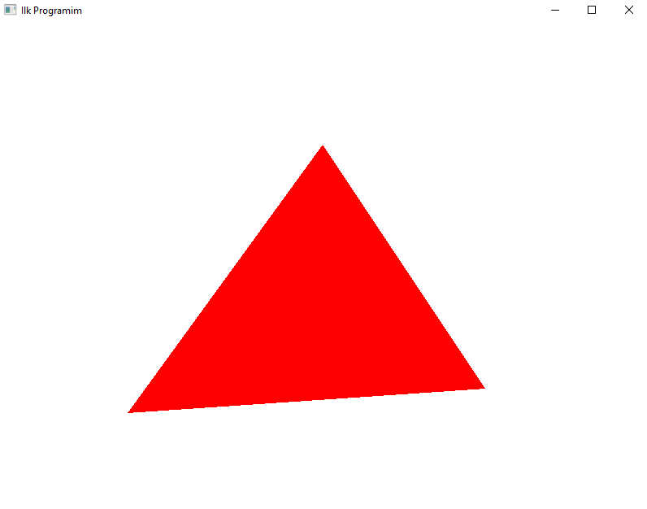
<h3>Ders02</h3>
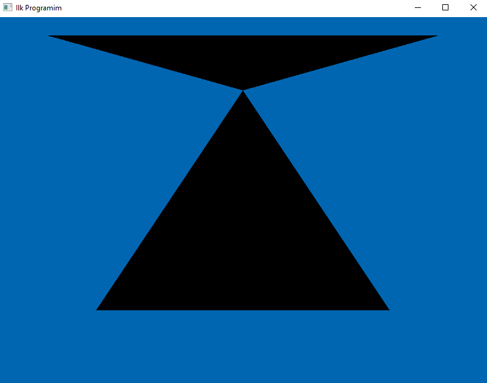
<h3>Ders03</h3>
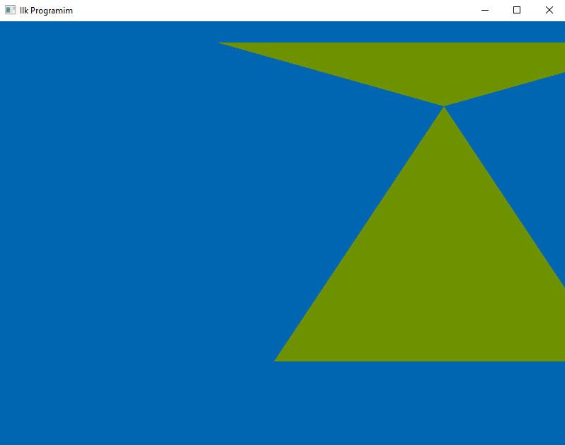
<h3>Ders04</h3>
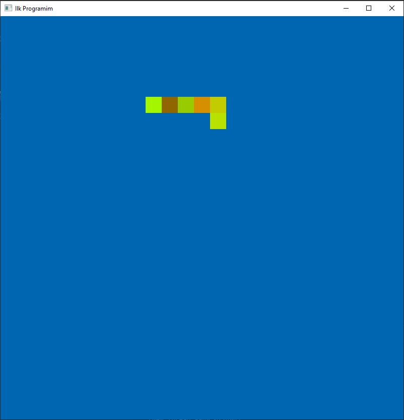
<h3>Ders05</h3>
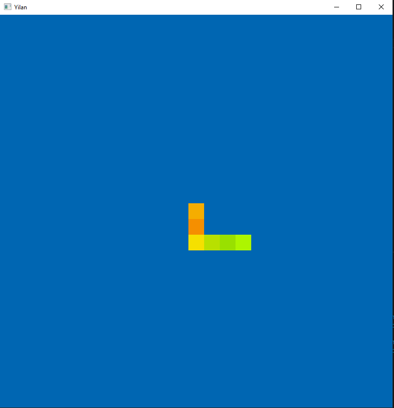
<h3>Ders06</h3>
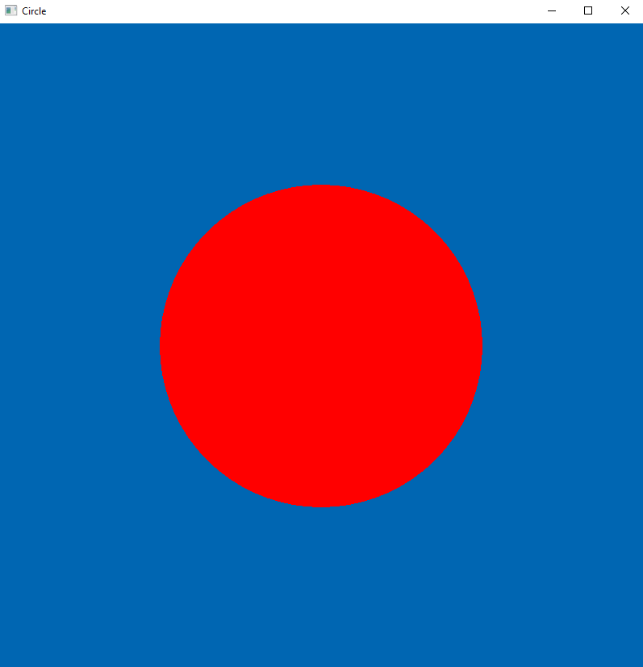
<h3>Ders07</h3>
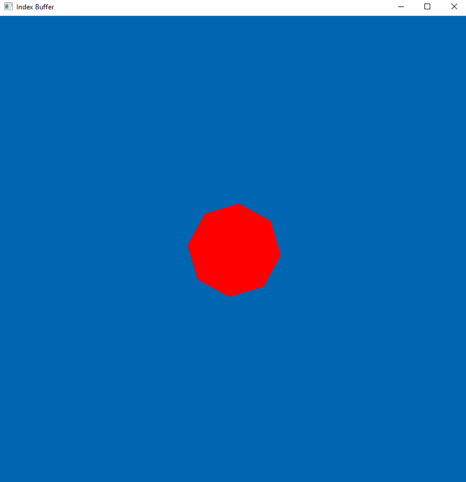
<h3>Ders08</h3>
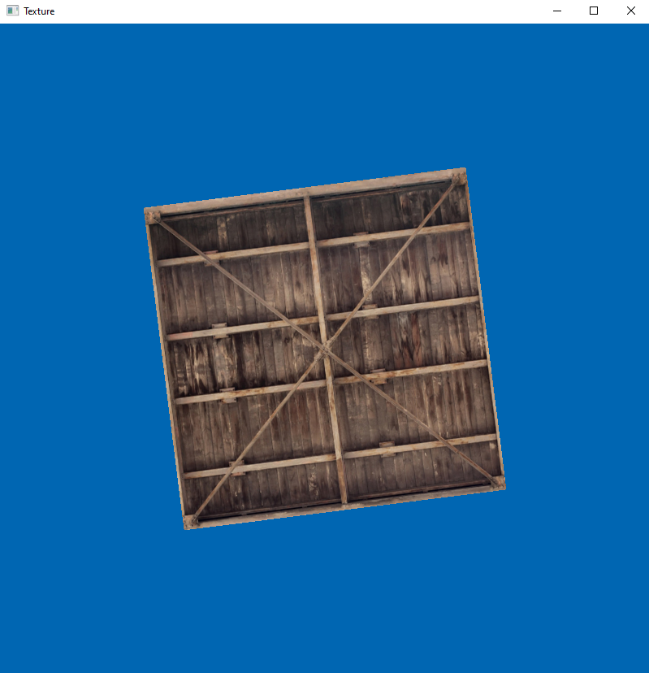
<h3>Ders09</h3>
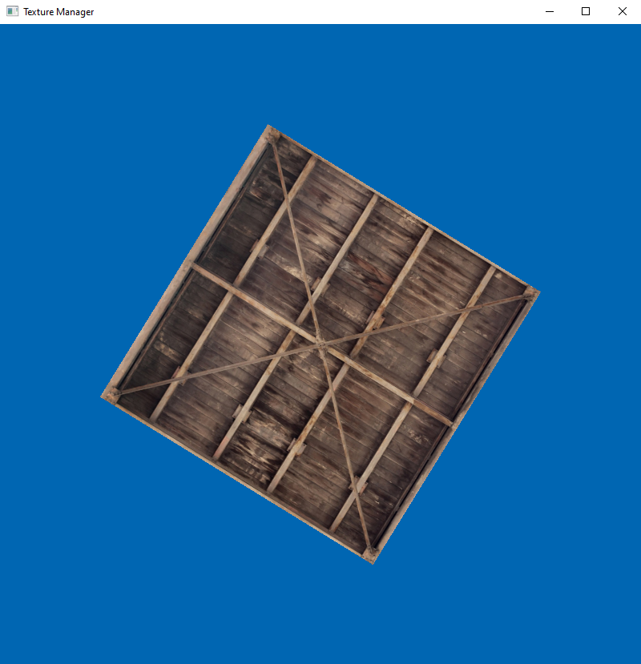
<h3>Ders10</h3>
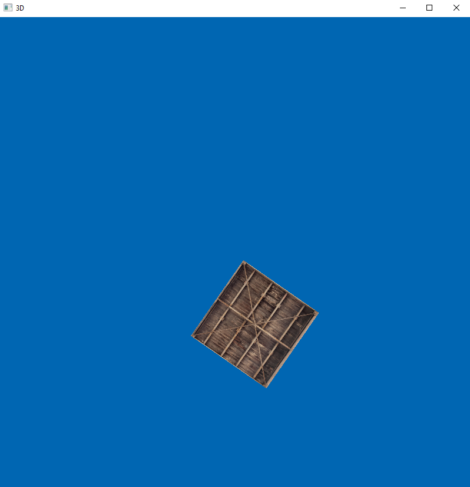
<h3>Ders11</h3>
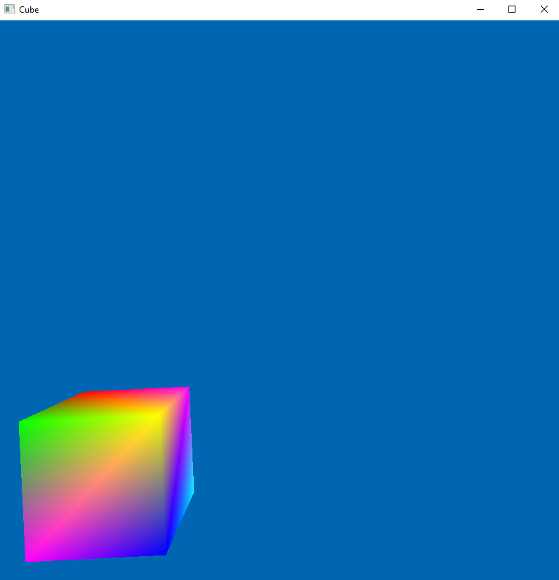
<h3>Ders12</h3>
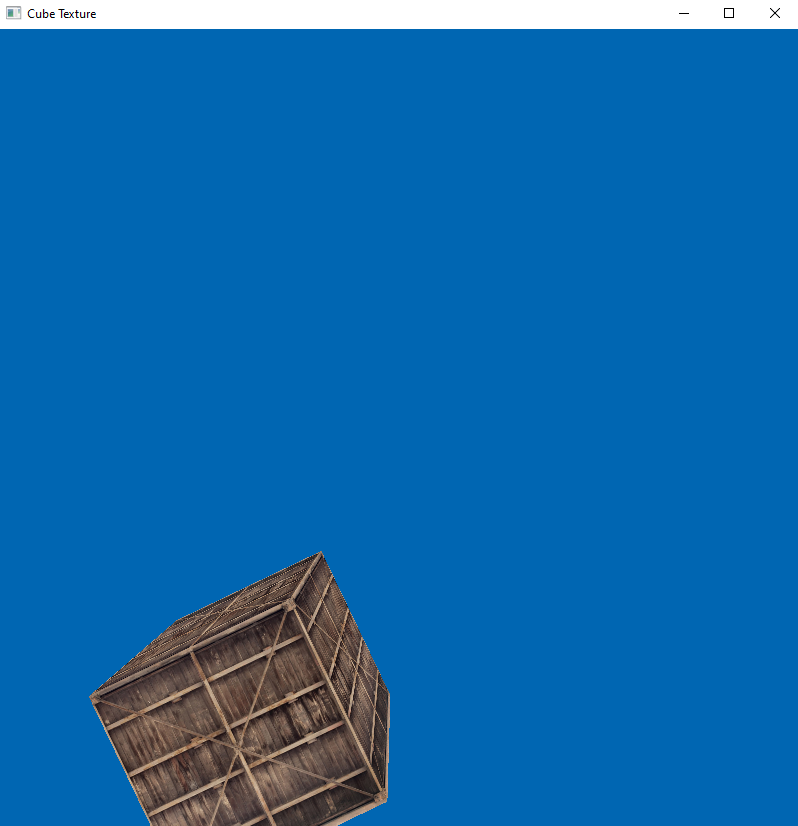
<h3>Ders13</h3>
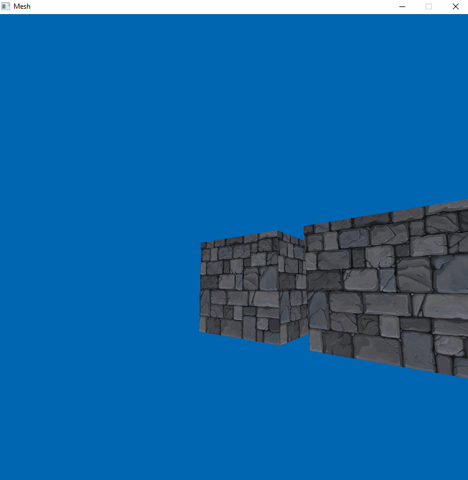
<h3>Uygulama TETRIS</h3>
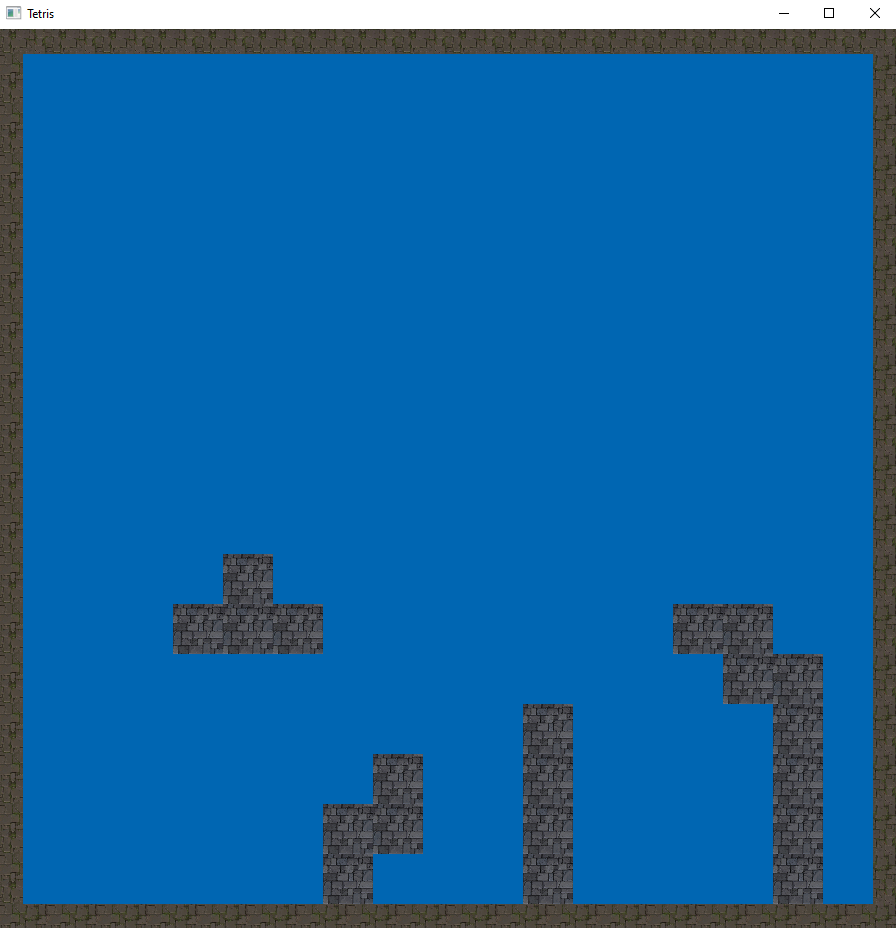
